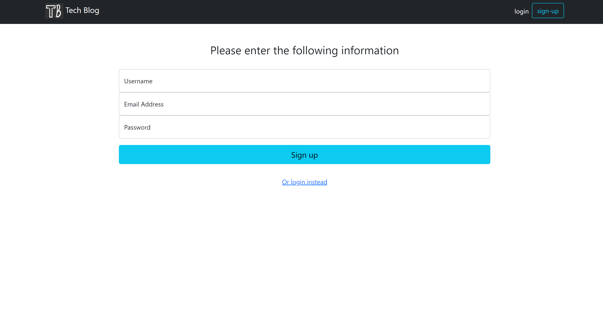
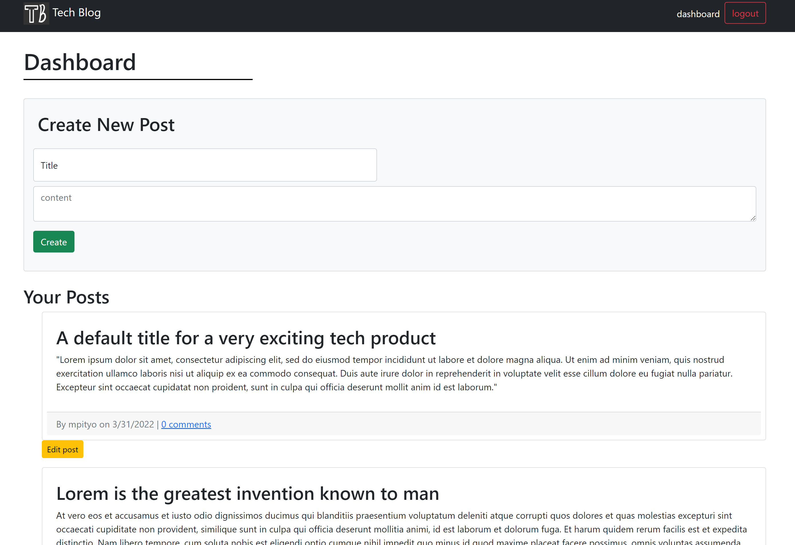
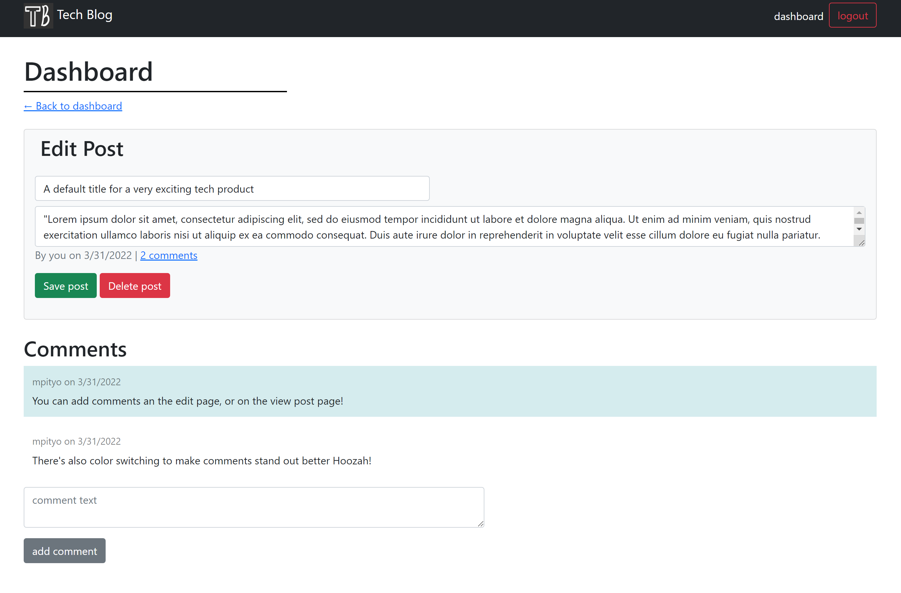

# Tech Blog
[](https://opensource.org/licenses/MIT)  

## Table of Contents

1. [Description](#📖Description)
2. [Installation](#🚚Installation)
3. [Contributing](#🧑‍🤝‍🧑Contributing)
4. [License](#📝License)
5. [Credit](#:trophy:Credit)
6. [Questions](#❔Questions)

## 📖Description
Join others across the web in discussing and reading about technology in a blog that is focused solely on technology. Create an account, post a blog, comment on others, and have the ability to edit and delete older posts you no longer want.

## 🚚Installation
** This requires SQL to be installed and set up first **
<br>
** This is for a local copy. Alternatively you may visit the heroku page [here](https://tech-blog-211.herokuapp.com/)**
1. Clone the codebase from the [repo](https://github.com/mpityo/tech-blog).
2. Query to the root file directory in any command prompt
3. Run the following command to install required packages:
```
npm install
```
4. Create a <heavy>.env</heavy> file in the root of the folder and input the following:
```
DB_NAME='tech_blog_db'
DB_USER='username'
DB_PW='password'
```
5. Make sure to change the username and password to your MYSQL information
6. Open mysql through the cmd line:
```
mysql -u root -p
```
7. Run schema to create database and tables:
```
SOURCE db/schema.sql;
quit;
```
9. Start the server:
```
npm start
```

## 🧑‍🤝‍🧑Contributing
You may contribute to this project by forking, then pushing your changes as a pull request for review. 
<br>
Any upgrades or enhancements are welcome, but here are some to get you started:
 - Deleting and editing comments 
 - Adding tags to each post 
 - View a user and their information
 - Search posts.
    
## 📝License
This project is licensed under the terms of the [MIT](https://opensource.org/licenses/MIT) license

## :trophy:Credit
Project idea by @ucfbootcamp
<br>
Full code, functionality, and design by yours truly @mpityo

## ❔Questions
You may reach me at GitHub under [mpityo](https://github.com/mpityo)
<br>
You can also shoot an email to [mpityo@gmail.com](mailto:mpityo@gmail.com)



